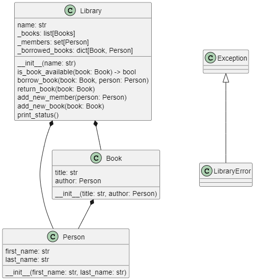
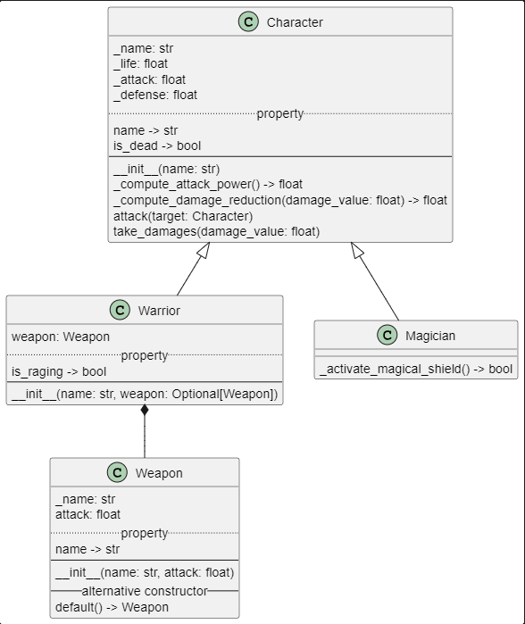

# TP Programmation Orientée Objet

## Consignes générales

Ce TP dure 2h et se compose de deux exercices.

Le contenu du code est évalué.
Une première version du code sera rendue à la fin de la séance. Une deuxième version pourra être remise jusqu'à un délai d'une semaine pour améliorer sa note.

La qualité du code sera prise en compte dans la notation. Nous attendons donc notamment :
- un bon nommage des variables/fonctions/classes...
- des annotations de types
- des docstrings
- une bonne séparation des responsabilités

## Consignes pour le rendu :warning: IMPORTANT :warning:

#### Rendu obligatoire en fin de séance

Vous rendrez directement votre travail en "pushant" vos modifications sur votre branche.

IMPORTANT :
- Dès le début du TP, immédiatement après avoir cloné le repository de ce TP, créer votre branche et basculez dessus.
- **Votre branche devra obligatoirement se nommer ``NOM-PRENOM``**, en remplaçant par votre nom et prénom.
- Vous pouvez pusher autant de fois que vous voulez sur votre branche, et autant de commits que vous désirez.

#### Rendu optionnel

Vous avez la possibilité de continuer et d'améliorer votre travail à la maison et de soumettre un deuxième rendu. **La date limite pour ce deuxième rendu et d'une semaine après la séance de TP.** Pour cela : créer un nouveau repository sur votre compte GitHub. Une fois votre travail dans ce repository prêt, envoyez le lien vers ce repository à loic.riegel@uha.fr et francois.ludwinski@uha.fr. Veillez à ce que le repository soit public.
Ce deuxième rendu vous permettra d'améliorer votre note.

## Exercice 1 : Bibliothèque

L'exercice est à effectuer dans le fichier `Exo_1/library.py`.

L'objectif de cet exercice est de modéliser une bibliothèque constituée de livres que l'on peut emprunter. 
Pour emprunter un livre il faut être membre de la bibliothèque.

Voici le diagramme de classe de la modélisation choisie :




1. Implémentez la classe `Person`.

    Person:
    - `first_name` (de type `str`)
    - `last_name` (de type `str`)

    Implémentez une représentation de l'objet (`__repr__`, `__str__`), permettant le résultat suivant :
    ```python
    antoine = Person("Antoine", "Dupont")
    print(antoine)
    ```

    Console :
    ```shell
    Antoine Dupont
    ```
    Les deux méthodes ``__repr__`` et ``__str__`` renvoient la même chose.

1. Implémentez la classe `Book`.

    Book:
    - `title` (de type `str`)
    - `author` (de type `Person`)

    Implémentez une représentation de l'objet permettant le résultat suivant :

    ```python
    novel_book = Book("Vingt mille lieues sous les mers", Person("Jules", "Verne"))
    print(novel_book)
    ```

    Console :
    ```shell
    Vingt mille lieues sous les mers (Jules Verne)
    ```

1. Implémentez la classe `Library`.

    Library:
    - `name` (`str`) *nom de la bibliothèque*
    - `_books` (`list[Books]`)  *catalogue de la bibliothèque*
    - `_members` (`set[Person]`) *membre de la bibliothèque*
    - `_borrowed_books` (`dict[Book, Person]`)

    L'objet library se construira de la manière suivante :
    ```python
    library = Library("Public library")
    ```

1. Implémentez dans la classe `Library` la méthode `is_book_available(book: Book) -> bool`.
Cette méthode indique si le livre passé en argument est disponible pour un prêt.
Si le livre n'existe pas dans le catalogue de la bibliothèque, une `LibraryError` sera levée. 

1. Implémentez dans la classe `Library` la méthode `borrow_book(book: Book, person: Person)` qui enregistre l’emprunt du livre `book` par la personne `person`.
Si la personne n'est pas membre une erreur sera levée.
Si le livre n'est pas dans le catalogue une erreur sera levée.
Si le livre est déjà emprunté une erreur sera levée.

1. Implémentez dans la classe `Library` la méthode `return_book(book: Book)` que enregistre le retour d'un livre dans la bibliothèque.
Si le livre n'était pas déjà emprunté une erreur sera levée.

1. Implémentez dans la classe `Library` les méthodes `add_new_member(person: Person)` et `add_new_book(book: Book)` qui permettent d'ajouter un nouveau membre, respectivement un nouveau livre, à la bibliothèque.

1. Implémentez dans la classe `Library` la méthode `print_status()` qui affichera l'état actuel de la bibliothèque dans la console. 

    Le code suivant : 
    ```python
    antoine = Person("Antoine", "Dupont")
    print(antoine)

    julia = Person("Julia", "Roberts")
    print(julia)

    rugby_book = Book("Jouer au rugby pour les nuls", Person("Louis", "BB"))
    print(rugby_book)

    novel_book = Book("Vingt mille lieues sous les mers", Person("Jules", "Verne"))
    print(novel_book)

    library = Library("Public library")
    library.print_status()

    library.add_new_book(rugby_book)
    library.add_new_book(novel_book)
    library.add_new_member(antoine)
    library.add_new_member(julia)
    library.print_status()
    ```

    devra renvoyer :

    Console :
    ```txt
    Public library status:
    Books catalogue: []
    Members: set()
    Available books: []
    Borrowed books: {}
    -----
    Public library status:
    Books catalogue: [Jouer au rugby pour les nuls (Louis Bb), Vingt mille lieues sous les mers (Jules Verne)]
    Members: {Antoine Dupont, Julia Roberts}
    Available books: [Jouer au rugby pour les nuls (Louis Bb), Vingt mille lieues sous les mers (Jules Verne)]
    Borrowed books: {}
    -----
    ```

1. Testez votre code. Le script suivant :

    ```python
    antoine = Person("Antoine", "Dupont")
    print(antoine)

    julia = Person("Julia", "Roberts")
    print(julia)

    rugby_book = Book("Jouer au rugby pour les nuls", Person("Louis", "BB"))
    print(rugby_book)

    novel_book = Book("Vingt mille lieues sous les mers", Person("Jules", "Verne"))
    print(novel_book)

    library = Library("Public library")
    library.print_status()

    library.add_new_book(rugby_book)
    library.add_new_book(novel_book)
    library.add_new_member(antoine)
    library.add_new_member(julia)
    library.print_status()

    print(f"Is {rugby_book} available? {library.is_book_available(rugby_book)}")
    library.borrow_book(rugby_book, antoine)
    library.print_status()

    try:
        library.borrow_book(rugby_book, julia)
    except LibraryError as error:
        print(error)

    try:
        library.borrow_book(Book("Roméo et Juliette", Person("William", "Shakespeare")), julia)
    except LibraryError as error:
        print(error)

    try:
        library.borrow_book(novel_book, Person("Simone", "Veil"))
    except LibraryError as error:
        print(error)

    try:
        library.return_book(novel_book)
    except LibraryError as error:
        print(error)

    library.return_book(rugby_book)
    library.borrow_book(novel_book, julia)
    library.print_status()

    library.borrow_book(rugby_book, julia)
    library.print_status()
    ```

    doit retourner le résultat suivant:

    Console :
    ```txt
    Antoine Dupont
    Julia Roberts
    Jouer au rugby pour les nuls (Louis Bb)
    Vingt mille lieues sous les mers (Jules Verne)
    Public library status:
    Books catalogue: []
    Members: set()
    Available books: []
    Borrowed books: {}
    -----
    Public library status:
    Books catalogue: [Jouer au rugby pour les nuls (Louis Bb), Vingt mille lieues sous les mers (Jules Verne)]
    Members: {Antoine Dupont, Julia Roberts}
    Available books: [Jouer au rugby pour les nuls (Louis Bb), Vingt mille lieues sous les mers (Jules Verne)]
    Borrowed books: {}
    -----
    Is Jouer au rugby pour les nuls (Louis Bb) available? True
    Public library status:
    Books catalogue: [Jouer au rugby pour les nuls (Louis Bb), Vingt mille lieues sous les mers (Jules Verne)]
    Members: {Antoine Dupont, Julia Roberts}
    Available books: [Vingt mille lieues sous les mers (Jules Verne)]
    Borrowed books: {Jouer au rugby pour les nuls (Louis Bb): Antoine Dupont}
    -----
    Jouer au rugby pour les nuls (Louis Bb) is already borrowed by Antoine Dupont
    Roméo et Juliette (William Shakespeare) doesn't exist in the library
    Simone Veil is not a member of the library
    Vingt mille lieues sous les mers (Jules Verne) is not part of the borrowed books
    Public library status:
    Books catalogue: [Jouer au rugby pour les nuls (Louis Bb), Vingt mille lieues sous les mers (Jules Verne)]
    Members: {Antoine Dupont, Julia Roberts}
    Available books: [Jouer au rugby pour les nuls (Louis Bb)]
    Borrowed books: {Vingt mille lieues sous les mers (Jules Verne): Julia Roberts}
    -----
    Public library status:
    Books catalogue: [Jouer au rugby pour les nuls (Louis Bb), Vingt mille lieues sous les mers (Jules Verne)]
    Members: {Antoine Dupont, Julia Roberts}
    Available books: []
    Borrowed books: {Vingt mille lieues sous les mers (Jules Verne): Julia Roberts, Jouer au rugby pour les nuls (Louis Bb): Julia Roberts}
    -----
    ```


## Exercice 2 : POO fighters

L'exercice est à effectuer dans le fichier `Exo_2/character.py`.

L'objectif est d'implémenter un jeu de combat tour par tour ou des personnages s'affrontent. 
Vous serez en charge de l'implémentation des caractéristiques de chaque personnage.

Voici les règles du jeu:

- Un combat pour commencer doit contenir au minimum deux combattants.

- A chaque tour : 
    - L'ordre des personnages est mélangé. 
    - Chaque personnage vivant attaque tous les personnages vivants. 

- Le combat se termine si :
    - Tous les combattants sont morts.
    - Le joueur interrompt le combat.
    - Il ne reste qu'un survivant, auquel cas celui-ci devient le gagnant.

- Un personnage meurt s'il atteint zéro point de vie.

Les personnages ont trois statistiques de base:

- Vie: Nombre de point de vie. Valeur de base: 100
- Attaque: Nombre de dégâts donnés à chaque tour. Valeur de base: 20
- Defense: Pourcentage de réduction de dégâts. Valeur de base: 10%

On introduit deux classe de combattant: les guerriers et les magiciens.

La classe des guerriers :

- Les guerrier ont 1.5 fois plus de vie qu'un personnage de base et 1.2 fois plus de défense qu'un personnage de base. 

- Ils peuvent s'équiper d'une arme qui leur ajoute de l'attaque. Ils infligeront donc plus de dégâts à leurs adversaires.

- Lorsque leur niveau de vie descend en dessous de 20% de leur vie de base, ils rentrent en état de "rage" et infligent 20% de dégâts supplémentaires.


La classe des magiciens :

- Les magiciens ont 20% de vie en moins qu'un personnage de base et 2 fois plus d'attaque qu'un personnage de base.

- Un fois sur trois lorsqu'un magicien est attaqué, il peut invoquer un bouclier magique qui absorbe tous les dégâts de l'attaque. Il ne prend alors aucun dégât.

Voici le diagramme de classe de la modélisation choisie :




1. Implémentez la classe `Character`.

    Character:
    - `_name` (`str`), *nom du personnage*
    - `_life` (`float`), *point de vie*
    - `_attack` (`float`) *Nombre de dégât*
    - `_defense` (`float`) *Pourcentage de réduction de dégât*
    
1. Implémentez dans la classe `Character` la méthode `take_damages(value: damage_value: float)`. Cette méthode calcule le nombre de dégâts subit par le personnage après application de la réduction de dégât puis les déduit de la vie du personnage. Une défense de 0.1 correspond à une réduction de 10% des dégâts subis.

1. Implémentez dans la classe `Character` la méthode `attack(target: Character)` qui attaque une cible. Cette méthode calcule d'abord combien de dégâts le personnage possède puis appelle la méthode `take_damages` de sa cible pour infliger les dégâts. Les dégâts d'un personnage correspondent à son montant d'attaque. Un personnage avec 10 d'attaque infligera 10 dégâts.

1. Implémentez un représentation de la classe `Character`, comme décrit ci-dessous :

    ```python
    basic_fighter = Character("Soldier")
    print(basic_fighter) # will print character name and remaining amount of life.
    ```

    Console :
    ```txt
    Soldier <100.000>
    ```

1. Implémentez la *property* `name` qui renvoie le nom du personnage.

1. Implémentez la *property* `is_dead` qui revoie `True` si le personnage est mort, `False` si le personnage est vivant.

1. Implémentez la classe `Weapon`. 

    Weapon:
    - `_name` (`str`)
    - `attack` (`float`)

1. Dans la classe `Weapon` implémentez un constructeur alternatif `default` qui construira un `Weapon` nommé "Wood stick" avec 1 dégât d'attaque. Rappel: Utilisez une "classmethod".

1. Implémentez la *property* `name` qui renvoie le nom de l'arme.

1. Implémentez la classe `Warrior` qui hérite de `Character`.

    Warrior(Character):
    - weapon: `Weapon`

    Attention les statistiques de base (vie et defense) d'un guerrier sont différentes qu'un personnage de base. Faites les changement nécessaire dans `__init__` pour correspondre aux règles du jeu.

    Le guerrier possède forcément une arme. Mais lors de sa création celle-ci est optionnelle. Si l'arme n'est pas renseignée lors de la création d'un guerrier, le guerrier se retrouve équipé d'une arme par défaut "bout de bois".

1. Implémentez la *propriété* `is_raging` dans la classe `Warrior` qui renvoie `True` si le guerrier est en rage.

1. Modifiez la méthode `attack` de la classe `Warrior` pour correspondre aux règles du jeu :
    - L'attaque de l'arme d'un guerrier s'additionne à ses dégâts de base
    - Si le guerrier est en rage ses dégâts augmentent de 20%

1. Implémentez la classe `Magician` qui hérite de `Character`. Modifier la fonction `__init__` pour implémenter les statistiques de base d'un magicien.

1. Implémentez la méthode `_activate_magical_shield() -> bool` dans la classe `Magician` qui renvoie `True` si le magicien active son bouclier (une chance sur trois). Utilisez le module [`random`](https://docs.python.org/3/library/random.html).

1. Modifiez la méthode `take_damages` de la classe `Magician` pour implémenter le mécanisme de bouclier magique.

1. Testez votre code en executant `Exo_2/main.py`.
